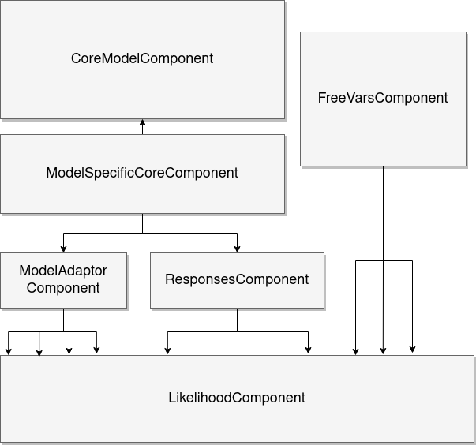

Core Model Builder
*******************

Introduction
--------------
`bayesian-models` aims to offer class based implementations of well known 
bayesian models. However models can be quite heterogenous with respect to their
internals and even their inputs. Implementing the relevant models directly
would likely result is somewhat inconsistent APIs with different inputs expected by
the user and possible code duplication. To overcome these challenges we treat
any arbitrary model as a composite entity, the elements of which are simply
called **components**. At the very least a model is composed of 

1. Some random variables, representing unknown parameters to be estimated
2. A set of equations defining the model
3. A likelihood over the observed data

Consider three common use-cases. In standard linear regression a Normal likelihood
is assumed over the observations and the output of the model ($f$) becomes the
input of the distributions' shape parameter :math:`\mu`. This leaves the 
:math:`\sigma` parameter unaccounted for. Hence we have to insert it as additional
parameter to be estimated. Yet there is something inherently different about the
parameter :math:`\sigma`, it does not participate in the models' equations,
directly and behaves more like nuissance parameter. In Bayesian neural nets
the models output is typically a high rank tensor, whose last axis is the output
neurons. These are generally the shape parameters of a full probability distribution
over the output quantity. Hence we have to split the tensor pass the subtensors
to their corresponding shape parameters, i.e.

.. code-block:: 

    y = pymc.Normal('y_obs', mu = f.T[0,...], sigma=f.T[1,...])

In some cases the models' output can be fed directly to the likelihood, i.e. when
there is only one shape parameter. For example for Dirichlet networks for classification
the likelihood would look like:

.. code-block:: 

    y = pymc.Dirichlet('y_obs', a = f)

A way is needed to enable the handling of all of these cases in a way that is consistent
across all models. Our proposed solution is to treat the model itself as a composite
object:

This makes clearly delineates the responsibilities and roles of sepperate parts
of the model. The model creation process is handled by a dedicated builder which
assembles the model based on its specified components. The different components
are:

Core Model Component
+++++++++++++++++++++

Every model must specify some basic random variables to infer. These are handled
by the `CoreModelComponent`. The random variables inserted by this component are
the parameters of the equations that specify the model. This component is generally
not used directly. Rather it is subclassed by model-specific `CoreComponents`
that delegate to the parent `CoreModelComponent` the random variable handling and
they themselves specify the equations (usualy as deterministics). To maintain a
clean API the specialized `Distribution` class is used to encapsulate all information
required by the distribution. Data, both inputs and outputs are provided with
the same `Distribution` API and replacing the distribution with the `pymc.Data`
function.

Likelihood Component
+++++++++++++++++++++

This specialized component requires two basic inputs, the actual distribution
to be used along with a variable mapping. The later specifies which variables
map to which shape parameters and is always of the a mapping of strings to strings.
Its keys are shape parameter names and its values are internal ids of variables.
All other components maintain a catalogue of variables they added to the model
along with internal ids. In some cases, multiple likelihoods are appropriate.
These can be passed to the builder as a list of `LikelihoodComponent` objects.
These objects also have an `observed` attribute which should generaly be left
to the default value ('observed'). For multiple likelihoods, this attribute should
be explicitly provided as the name of the variable

Free Variables Component
++++++++++++++++++++++++++

As mentioned in the Linear Regression example, sometimes 'extra' variables need
to be added to the model. While these cases can be handled by the `CoreModelComponent`
techinicaly these parameters can be conceptualized as sepperate from the rest,
in the sense that they do not participate in the core expressions of the model
itself. This component is optional and should be used whenever a model needs
parameters (random variables) that are not involved in whatever equations express
the model.

Response Component
++++++++++++++++++++

Some models require a *response function* to tranform the models outputs to prior
to them being passed to the likelihood. While the name is a reference to neural
networks, a common use case for them, they can be used whenever a variable requires
transforming. The transformations themselves are defined using the specialized
`Responses` object. A response is defined with three mappings. `application_targets`
map the transforms name to the name of the varibale to be transformed. `functions`
maps the names of the transforms to callable object which perform the transformation
and `records` maps the name to a boolean, indicating if the result of the transform
should be recorded in the trace as a deterministic or not. The `Responses` object
should be passed to the `ResponsesComponent`.

Model Adaptor Component
+++++++++++++++++++++++++++

The `ModelAdaptorComponent` is used to split the models output into subtensors
that can then be mapped to other parameters (typicaly the shape parameters of
the likelihood). This functionality could arguably be accomplished by using
`ResponsesComponent`s for the indexing and slicing, however their applications
are different, so it makes sense to keep them logically sepperate.
