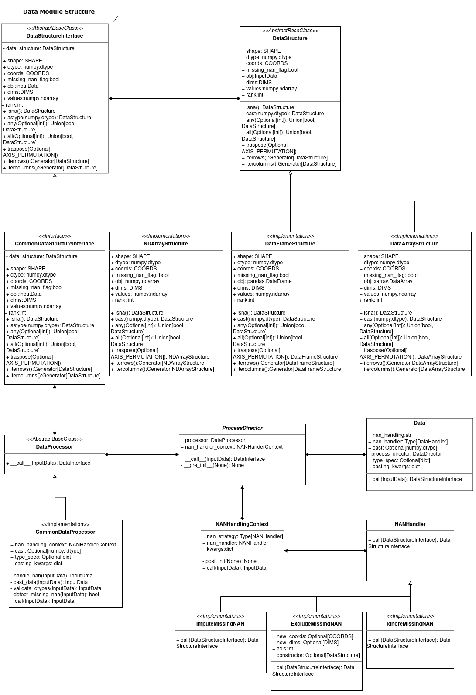

Data Handling
********************

General
----------

In pretty much every model deployement process some level of data preprocessing
is needed. Certain tasks especially much be done in every case, and regardless
of the model worked with. These are briefly:

* Missing data detection and handling
* Type checking and handling

Most libraries and software solutions place the responsibility on the user
to ensure data integrity. However it both easy and common for users to miss
proper missing data handling and casting is rarely considered. Many models
require specific types for their inputs and failure to properly account for
missing values and wrong types can result in errors that bubble at runtime, resulting
in strange errors.
These tasks can easily be automated for most use cases, hence to maintain accessibility,
:code:`bayesian_models` aims to provide this functionality. Missing values can be 
imputed with certain strategies but are usually simply discarded. Another implementation
detail is the use of 64 bit floats. This is somewhat wasteful for many applications
as ubiquitous In-Domain uncertainty is generally much greater than machine precision.
Hence we can reduce memory consumption by using 32 bit floats
A much greater problem is the input data itself. Python has many libraries
which implement matrices and tensors with different pros and cons and most importantly
difference APIs. Three major implementations have to be considered: :code:`numpy`,
:code:`pandas` and :code:`xarray`. These implementations are quite different for each other.
:code:`numpy` implements :code:`NDArray`s un-labelled arbitrary rank tensors. The objects
are quite simple to use as their lack of labels makes this input-agnostic, however
this requires that the user keeps track the semantics of the array itself. :code:`pandas`
is likely the most widely used library and provides three core data structures,
:code:`Series` a labeled vector, :code:`DataArray` a labeled 2D matrix and the rarely used
and pivot table with limited support for 3D inputs. Pandas offers labeling options
and ways to use 'numpy-style' manipulations for the data (i.e. using indices
rather that labels). :code:`xarray` offers two main data structures, the :code:`DataArray`
an extensively labelled arbitrary rank tensor, and the :code:`DataSet`, a collection
of :code:`DataArray`s.
Considering different models may accept different inputs the question arises,
which one do we use? For many models :code:`pandas.DataFrame` is perfectly satisfactory
but some models i.e. image classifier neural nets may accept higher rank tensors
instead. We could choose :code:`numpy` as the 'common denominator' but this is unecessarily
restrictive and make data presentation less pretty and consise. We could go
the opposite way and enfore use of :code:`array.DataArray` since it is theoretically
the most general, but :code:`xarray` is less well known and is hidered by some strange
nomenclature. Furthermore, it's API is heavily focused on the use of labels
which makes more difficult to use in an input-agnostic way. An obvious problem
here is that this libraries have different interfaces i.e. :code:`numpy.isnan` vs
:code:`pandas.DataFrame().isna()`. One option could be to adapt the inputs by converting
everything to a common underlying structure, but this would require either discarding
information or dealing with :code:`xarray`s more cumbersome API.

The solution implemented here a 'best-of-both-worlds' approach. The Data module
deals with the issues by standardizing the interfaces with specialized classes
that enforce a common API. This approach aliviates the model object themselves
from having the responsibility the check and process their inputs and has another
handy benefit - it is easily extensible. If there is an additional requirement
for handling a new tensor implementation, for example :code:`pytensor`, :code:`tensorflow`
or :code:`aesara` these can be cleanly added - so long as the common API can be enforced.

For the actuall processing itself, we can delegate to specialized builder classes
and easily make them extensible, rather that burder model object with processing
their own data. This responsibility is delegated to this specialized submodule.
Lastly, users need not be concerned with the backend details, hence a simpler
API is enforced, to hide the backend intricacies.

