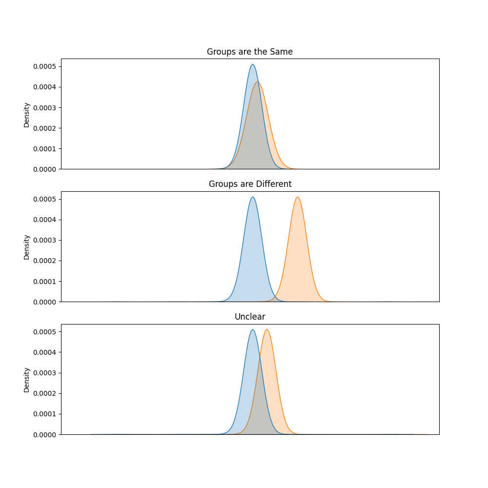
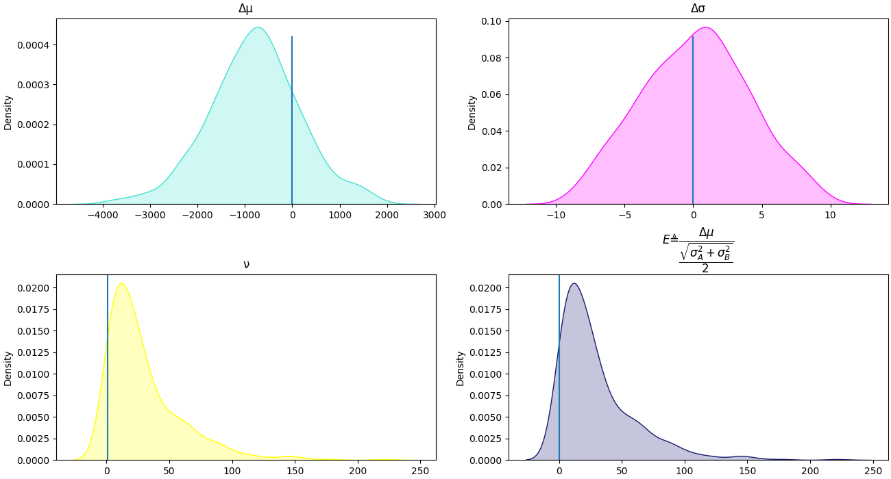
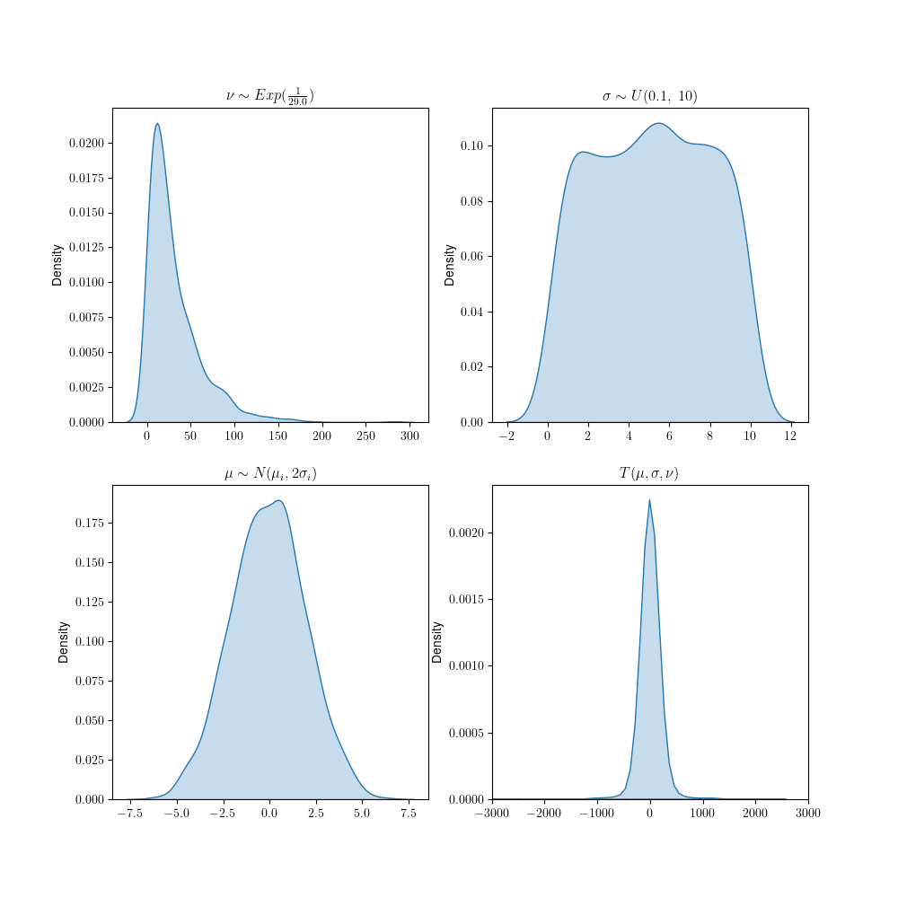

.. _BEST Theory:
Bayesian Estimation Superceeds The t Test (BEST) 
*************************************************

This is a short introduction to the group comparison model `Bayesian
Estimation Superceeds the t-Test
(BEST) <https://pubmed.ncbi.nlm.nih.gov/22774788/>`_ , adapted and
heavily based on the one from the official `pymc` documentation `found
here <https://docs.pymc.io/en/v3/
pymc-examples/examples/case_studies/BEST.html>`_.        

Introduction 
==============
 
A common problem in statistical inference is deciding if two or more
groups are different with respect to some measured quantity of interest.
Making this inference is complicated somewhat, by the fact that real
data are "contaminated" with some amount of randomness that hinders
attempts based on direct differences in the data. The *de facto*
standard for addressing these questions is **ANOVA** (*One Way Analysis
Of Variance*) and the **t Test** - more generally **hypothesis
testing**. These procedures typically involve expressing a **null
hypothesis** (:math:`H_0`) which usually declares that there are no
differences, and an **alternative hypothesis** (:math:`H_A`) which
typically states some differences exist. A **test statistic** is then
formulated, which is a quantity that determines if the observed data
(in terms of their distribution) are sufficiently plausible under the
given hypothesis.
 
Unfortunately, it can be quite difficult to use hypothesis tests
correctly. There are several subjective choices involved in the
procedure such as the test statistic and the hypothesis. These are
usually abstracted away form the user and a kind of "default" is used,
based on habit and tradition rather than justification on the problem
at hand.

The justification for these procedures is seen as questionable by some,
as they are essentially based on maximization of the repeatability of
the experiment - but surely, we should care about the outcomes of
individual experiments as well. More over these procedures frequently
fail to accurately describe reality, for they do not generally contain
any notion of the extent or size of the difference. Two different
datasets with major differences in the extent of their differences may
for example give the same P-value. The interpretation of their results
is also rather difficult and error prone, especially for non experts.
For example if the P-value does not exceed some arbitrarily selected
threshold (often 95% by tradition) this **does not** mean the null
hypothesis is upheld - indeed the null hypothesis can only be rejected,
never upheld. A fundamentally more informative approach is one based on
**estimation** rather than **testing**, and was proposed by Kruschke.
According to this approach complete distributions are fit to the data in
each group, which enables calculation of any Deterministic derived
quantity of interest, such as difference of means, or difference of
standard deviations.

Historical Context 
==========================

The broad class of techniques under the **Null Hypothesis Statistical
Testing** (*NHST*) umbrella were developed in the context of the
frequentist statistical paradigm and avoid invoking Bayes' theorem in
the inference process. Chronologically the **p-value** technique was
developed by Fischer and its the probability of making observations that
are just as extreme or more extreme as those that have been made. It was
intended to intended to express some notion of how "distant" the
observations are from the Null Hypothesis, after it is combined with
prior knowledge in some non-specific manner.

The mathematical machinery of NHST was developed originally by Neyman
and Spearman as an alternative approach to the one by Fischer. In these
procedures the pairs of Null and Alternative Hypotheses are formulated
and a test statistic is used to select the more plausible of the two.
Typical examples of NHST are **ANOVA** (*One Way Analysis Of Variance*)
and the t-Test. For example in the context of the t-test:

 .. math::         
    \begin{array}{c}
        \begin{array}{ccc}                 
            \begin{array}{cc}
                H_0:& \mu_1=\mu_2\\
                H_A: & \mu_1 > \mu_2\\
            \end{array}& &
            \begin{array}{cc}                 
                H_0:& \mu_1=\mu_2\\ 
                H_A: & \mu_1 \ne \mu_2\\
            \end{array}             
        \end{array}\\  
        \\             
        t\ =\ \dfrac{\bar{x_1}-\bar{x_2}}{
        \sqrt{\frac{s_1^2}{n_1}+\frac{s_2^2}{n_2}}             }
    \end{array} 
    
These two approaches were eventually "hybridized" and combined into one,
and it is this version that is commonly used today.

Objections and Criticisms 
============================= 
 
NHST procedures have come under severe criticism by experts in the
field, already since the 60's:
 
Problem 1: Focusing on the Null Hypothesis
-------------------------------------------

The null hypothesis constitutes a statement of no difference or
relationship which is generally contrary to what the analyst believes.
After all if an analyst truly believed there was no relation between a
categorical variable (which defines the group) and some continuous
quantity of interest they likely would not be conducting the test to
begin with. Indeed to begin conducting a hypothesis test, the analyst
nearly always suspects that the groups are different. Furthermore, the
null hypothesis ought to accepted as being "absolutely" true - its a
mathematical statement that doesn't include any notion of precision.
This is nearly impossible for most real world systems, where virtually
every variable is related to all other variables however weakly *(Meeh,
1980)*. It is pointless to question if they are different in practice -
they always are to some level of precision and to some decimal *(Turkey,
1991)*. Therefore, there is always a sample size, large enough, for
which the differences are statistically significant (more on that
later).
 
Problem 2: The popular rationale behind NHST is problematic
----------------------------------------------------------------
 
The logic underlying NHST is difficult is very unintuitive. Hence
exceedingly prone misinterpretation and erroneous extrapolation, leading
scientists and researchers to the wrong conclusions. Mathematicians and
statisticians are of course well aware of how to correctly read the
results of these procedures, however, these techniques are also being
widely applied to other fields, from chemistry to ecology, where they
are even more likely to be misinterpreted. Most non-specialists reason
about NHSTs as follows:

    If the null hypothesis were true, then it would be unlikely that
    data would have been observed. These data have been observed.
    Therefore, it is unlikely that the null hypothesis is correct

The syllogism seems innocuous at first, but is in fact wrong. This
becomes easier to see if we transform it another, logically equivalent
one *(Cohen, 1994)*

    If a person is an American, then they probably aren't a member of
    the Senate. This person is a member of the Senate. Therefore, he
    is not an American

It is evident that this syllogism is simply wrong, and the above
assumes that concepts such are the alternate hypothesis and the p-value
are being interpreted correctly, though frequently they are not.

Problem 3: Misinterpretation of the Null Hypothesis
-------------------------------------------------------

Researchers frequently assume that if the groups are not the same, then
they must be different. The reality is more complex than that, due to
the role of chance and bias. One needs to draw a destinction between the
alternate (:math:`H_A`) and the **research hypothesis** (:math:`H_R`). A
thorough examination of the logic of t tests (*A logical analysis of
null hypothesis significance testing  using popular terminology, Richard
McNulty, 2022*) and NHSTs reveals that one cannot conclude that a
grouping variable is singularly responsible for any observed differences
between groups. If the p-value drops below the specified threshold what
one can actually conclude is that "the observed differences are not due
to chance **alone**". Bridging the gap between the alternate and
research hypothesis requires some additional assumptions that rarely
justified and which are usually ignored, specifically:

1. The observed differences are **not** due to bias alone 
2. | There is no factor or combination of factors in which chance plays
     a role

Therefore NHST is rarely transparent about the assumptions it makes, but
still conveys a false sense of security.
 
Problem 4: The Test Does Not Reveal If The Null Hypothesis Is True
---------------------------------------------------------------------

Usually the analyst resorts to NHST because he is interested in
answering the question "is the research hypothesis true based on the
data?" or at least is the null hypothesis is true.Procedures such as
t-Tests and ANOVAs reveal nothing of this sort though many researchers
believe that it does. The p-value is the probability of making
observations as extreme or more extreme than those observed, conditioned
on the null hypothesis, not the probability that the null hypothesis is
True. This becomes clearer using common mathematical notation. In
mathematical notation the p value can written as
:math:`p(\mathbb{D}|H_0)` whereas the researcher is generally interested
in :math:`p(H_R|\mathbb{D})` or at least :math:`p(H_0|\mathbb{D})`.
Furthermore one should bear in mind:

.. math:: 

    \begin{array}{c}
        p(H_A|\mathbb{D})\ne p(\mathbb{D}|H_0)\\
        \\
        p(H_0|\mathbb{D})\ne 1-p(\mathbb{D}|H_0)
    \end{array}

This quantities are distinct and should not be conflated. It is very
tempting to do so, especially for the non specialist

.. attention:: 

    In case it is not obvious why t-Tests and the like, cannot answer
    the question "is the null hypothesis true based on the data", which
    the above papers alude to, pay close attention to the mathematical
    notation. The general notation :math:`p(A|B)` means, the probability
    of event :math:`A` occurring **conditioned** or given that event
    :math:`B` has occurred. The null hypothesis is assumed to be correct
    when NHSTs are conducted, hence once cannot assign a probability to
    it

Problem 5: Effect Size and Sample Size
----------------------------------------

The p-value is frequently interpreted as providing an estimate of the
"importance" of the findings. A lower p-value is frequently seen as
corresponding to larger difference between groups, however this is not
the case. Consider for example the t-Test:

.. math:: 

    t = \dfrac{\bar{x_1}-\bar{x_2}}{
        \sqrt{\frac{s_1^2}{N_1}+\frac{s_2^2}{N_2}}
        }

Notice that the statistic depends on both the effect size
(:math:`\bar{x_1}-\bar{x_2}`) and the sample size. This is what Cohen
and the others above were referencing. For any arbitrarily small
:math:`\bar{x_1}-\bar{x_2}` there is always a sample size sufficient to
reject the null hypothesis. Then, rejecting the null hypothesis becomes
a matter of collecting enough information (power). The fact that the
test provides little information on the magnitude of the observed
differences is particularly problematic.

.. note::
    
    Properly speaking, correct usage of the NHST procedures, typically involves a **design of experiment** stage. Here the analyst makes some assumptions about the problem at hand, such as the expected magnitude of the effect and probabilities of type I (:math:`\alpha`) and type II (:math:`\beta`) errors and calculates the required sample size. Unfortunately the analysis is not trivial, especially for complex experiments, which usually mean it's ignored outside of the life sciences statistics and mathematics. In other fields, it frequently ignored, which makes it difficult to know exactly **what** was detected by these allegedly important differences

Model Specification 
===================
 
In Kruschke's original paper a model is described for the case of two
groups and one quantity of interest, with some instructions for further
extensions. Real world data, generally involve multiple variables of
interest and possibly, multiple groups. While Kruschke provides some
guidelines for these extensions, these are left somewhat nebulous and
open to interpretation.

In the baseline case BEST operates by simply fitting distributions over
the quantity of interest for every group and then comparing these
distributions. Because in the Bayesian paradigm we have entire
distributions to work with, instead of singular point estimates, the
approach is fundamentally more informative that traditional NHST. In
rendering our decision we essentially examine the resulting
distributions as follows:

The distribution chosen for the data is the **Student T** distribution.
This distribution is chosen because, while similar to the Normal, it has
thicker tails and hence it is better at describing data with "extreme"
values, which are quite common in practice. The Student T distribution
(in one dimension) is given by:

 .. math::
    f(x,\mu, \lambda, \nu) = \frac{\Gamma (\frac{\nu+1}2 )}{
    \Gamma (\frac \nu 2)} \big( 
        \frac{\lambda}{\pi\nu} \big)^{\frac 12}
        \big[1+\frac{\lambda (x-\mu)^2}{\nu} \big]^
        {-\frac {\nu+1}2
    }
 
This distribution is defined by three shape parameters, two which
identical to the Normal (mean and standard deviation) and a unique
parameter :math:`\nu`. This parameter is called the **degrees of
freedom** and determines essentially the "normality" of the
distribution. For values of :math:`\nu` close to 1, the distribution has
thick tails, which shrink towards the equivalent normal as it increases.

From the above, we can calculate any derived, deterministic quantity,
primarily the **difference of means** (:math:`\Delta \mu`), the
**difference of standard deviations** (:math:`\Delta \sigma`) 
This immediately means we receive richly detailed information about the
problem at hand, having several distributions to work with rather that
simplistic point estimates

Because these are distributions, we can directly interpret them without
requiring the convoluted reasoning typing involved in NHSTs. The mode of
these distributions is the expected value and the variance can be
directly interpreted as the **uncertainty**. The narrower the
distribution is, the more certain we are of the value.

We can also define an  additional quantity which Kruschke terms the
**effect size**(:math:`E`). This is intended to express a kind of
standardized effect magnitude, though it is harder to interpret than the
rest, since it is not in the original units:

 .. math::
    E_{ij} \triangleq \dfrac{
        \Delta \mu_{ij}}{
        \frac{\sqrt{\sigma_i^2+\sigma_j^2}}{2}
        }

:math:`\Delta\mu` expresses the expected difference between the groups
and hence is the quantity we are primarily interested in.
:math:`\Delta\sigma` expresses the difference is variances between
groups and hence can be interpreted as expressing whether specific
instances of the observed, are affected differently for certain values
of the grouping variable. The effect size expresses a standardized
measure of the "magnitude" of the difference.

.. note::

    The 'effect size' quantity is somewhat harder to interpret, because
    it not in the original units. It is not included by default and has
    to be explicitly specified by the user as :code:`effect_size=True`
    to the BEST model object

We can phrase this problem more abstractly, which will be useful latter
when multiple groups will be discussed. Let :math:`\overset{N \times
M+1}{X}` be a matrix representing our measurements. This matrix is
composed of :math:`N` observations of :math:`M` continuous variables,
and we further assume an additional, categorical variable whose values
represent the groups themselves. Suppose this group variable takes
:math:`K` possible values. We split the data according to the value of
this variable :math:`{\mathbf{X_0,\dots,X_K}}` and fit distributions to
each group.

We can express this grouping as:

 .. math:: 
    \begin{array}{c}
        \mathbf{X_0} \thicksim \mathcal{T}(\nu_0, \mu_0, \sigma_0)\\
        \mathbf{X_1} \thicksim \mathcal{T}(\nu_1, \mu_1, \sigma_1)\\
        \vdots\\
        \mathbf{X_K} \thicksim \mathcal{T}(\nu_K, \mu_K, \sigma_K)\\     
    \end{array}
 
We must specify **priors** for these free parameters, which will be
estimated from the observed data. Kruschke proposes the following
prior distributions:

 .. math:: 
    \begin{array}{c}
        \nu_0=\nu_1=\dots =\nu_K=\nu\\
        \\
        \nu \thicksim 1 + \mathcal{Exp}(\lambda=\frac 1 {29.0})\\
        \\
        \mu_k \thicksim \mathcal{N}(\bar{\mu}_k,\ 2\bar{\sigma_k})\\
        \\
        \sigma_k \thicksim \mathcal{U}(10^{-3}, 10^3)
    \end{array}

These are rather diffuse priors, placing considerable probability
density over a large interval of values. More importantly, they do not
favour on group over the over. Graphically we depict these as:

We can make the simplifying assumption that the degrees of freedom are
the same across all groups, which is usually a good idea (but not
necessary) as we've found the alternative usually results in
**overfitting**. For the means, we declare one per group (as per
Kruschke's paper) and set them to a Normal centered around the empirical
pooled mean and standard deviation of the group itself. These quantities
are derived from the observations themselves, and constitute wide,
uninformative priors. More importantly, this does not favor one group
over the other *a priori*. For standard deviations we select a uniform
distribution in the interval :math:`[0.0001, 1000]`. As Kruschke himself
notes, these priors are exceedingly wide, and described this way only to
abstractly encompass all possible data (astronomical, medical, etc). For
most real-world applications, they are excessively large and should be
adjusted according the data and their units.

.. note::

    The default values for the Uniform distribution are :math:`0.1-10`
    as opposed to :math:`10^{-3}-10^3`

.. note:: 

    `bayesian-models` assumes the same degrees of freedom across all
    distributions and uses univariate student T by default. These
    defaults are chosen because they are quite sensible and closely
    follow the original formulation. Advanced users are given the option
    to set independent degrees of freedom for each univariate Student T,
    or even use a multivariate distribution instead. These settings are
    not recommended as in our experience allowing different degrees of
    freedom usually results in over fitting. The multivariate case
    assumes a diagonal scale matrix is computationally more expensive

Making Decisions: 
=================

To move from the hazy space of probabilities to that of actionable
decisions, we need to propose, apply and justify a **decision rule**.
Classical hypothesis testing typically justifies its decision making
process by appealing to reproducibility. Applying the t-Test is valid,
because it ensures Type I and Type II errors are minimized in the long
run, for infinite experiments and infinite researchers. There are
multiple rules by which one can arrive to binary (or really tertiary)
decisions - the one considered here is the earliest proposed for this
model and is called the **HDI+ROPE** rule. The true innovation of this
approach is the definition of the **ROPE** or the **Region Of Practical
Equivalence**. This is a region of values that practically equivalent
to zero. Hence the ROPE interval is defined on a problem specific basis
- *how big enough of difference is big enough?* The **credible
interval** (CI) is Bayesian equivalent of the confidence interval and
expresses a similar idea. It can be though of as the interval of values
considered plausible (under some probability threshold). From these two
we can arrive at our decisions according to the following rule: 

1. | If the CI and the ROPE have nothing in common, then none of the
     plausible values are equivalent to zero. We therefore decide the
     groups are **different**. 

2. | If the CI is entirely inside the ROPE, then all plausible values
     are equivalent to zero. Therefore we decide the groups are **the
     same**. 

3. | If the two intervals partially overlap, then *some* plausible
     values are equivalent to zero, while some are not. We therefore
     **withhold our decision** or simple declare it **Indeterminate**. 

This decision rule can be justified via a branch of
mathematics called  **Bayesian Decision Theory** which studies
decisions under a state of uncertainty. A full description is outside
the scope of this document (and this library), however we can provide a
rough outline. We begin by observing that decisions are generally not
made in a vacuum but are attended by **actions**. We therefore denote
:math:`\alpha\in \Alpha` the set all possible actions, :math:`\Theta`
the space of all possible values of model parameters and
:math:`\mathcal{X}` the space of all possible inputs. We define a
**loss function**:

 .. math:: 
    L:\mathcal{\Theta}\times\mathcal{\Alpha}\rightarrow \mathbb{R}_0^+
 
This function maps values of the model and decisions taken to a "cost"
of making this decision. We then define a **decision function**:
 
 .. math:: 
    \delta :\Theta \rightarrow \Alpha

From this, justification can be derived in a general way. In practice
formulating a problem specific loss function is usually difficult in
practice

Extensions:
===========

Multiple Inputs:
----------------
 
To extend the model for multiple inputs, there are several options. We
can replace the univariate with a **multivariate Student T**, or use
multiple, univariate distributions. The multivariate Student T has a
pdf of:

 .. math:: 
    f(\mathbf{x}, \nu,\mu,\Sigma) = \frac{
        \Gamma\left[(\nu+p)/2\right]}{
        \Gamma(\nu/2)\nu^{p/2}\pi^{p/2
        }\left|{\Sigma}\right|^{1/2}\left[1+\frac{1}{\nu}({
        \mathbf x}-{\mu})^T{\Sigma}^{-1}({\mathbf x}-{\mu})\right]^{
        -(\nu+p)/2}
        }

Note the Multivariate distribution, replaces the parameter
:math:`\sigma` with a **covariance matrix**. The element of the
diagonal of his matrix are variances across each input variable, and
the off-diagonal elements are **covariances** between different
variables. We assume this matrix is diagonal i.e. that there are no
covariances between the input variables (since we are generally not
interested in describing the covariances themselves). Alternatively we
can fit independent univariate distributions for each input variable.
We can assume the same degrees of freedom for each of allow them to be
independent. The former case is theoretically identical to the
multivariate with a diagonal covariance matrix, but more
computationally expensive. The latter case is possible but prone to
overfitting.

Multiple Groups:
----------------

Kruschke provides some guidelines on how to extend this model for
multiple groups but provides no tangible examples. We interpret his
recommendation to place independent :math:`\mu_k` and :math:`\nu_k` as
pair-wise comparisons between the groups. Hence we implement
comparisons for all combinations of values of the grouping variable.
Therefore, for :math:`i,j\in\{0, \dots K\}` we generate all
combinations (unique pairs without repetition or order) and the
derived metrics would be:

 .. math:: 
    \begin{array}{c}
        \Delta\mu_{00}\\
        \Delta\sigma_{00}\\
        E_{00}\\
        \Delta\mu_{01}\\
        \Delta\sigma_{01}\\ 
        E_{01}\\
        \vdots\\
        \Delta\mu_{ij}\\
        \Delta \sigma_{ij}\\
        E_{ij}\\
        \vdots\\
        \Delta\mu_{KK-1}\\
        \Delta \sigma_{KK-1}\\
        E_{KK-1}\\
    \end{array}

Options and Alternative Formulations 
========================================

There are multiple ways to extend the base model, that Kruchke mentions,
not all are accounted for in this implementation. The distribution could
be replaced with a LogNormal for special cases, for example. There are
alternative ways to generalize the model as well. One could for example
relax the diagonality assumption and model the resulting matrices with
the specialized LKJCholesky distribution (included in :code:`pymc`).
Another possibility is including a hierarchical distribution for the
means, however this formulation is rather nebulous and would likely
overcomplicate things. For this reason we chose not to include it. It
could potentially be considered in the future however. In terms of the
options that are present in this implementation, the default option is
univariate distribution with common degrees of freedom. Allowing
independent degrees of freedom for input variables, we've found (via
loo) usually results in overfitting. This case is identical to the
multivariate, but more efficient.

Implementation: 
==================

The terms of the actual software implementation, the above model is
represented by the :code:`bayesian_models.models.BEST` class. Like all
models it implements the general four methods :code:`__init__`,
:code:`__call__`, :code:`fit` and :code:`predict`. The :code:`__init__`
method is responsible of setting all parameters and hyperparameters of
the model itself. Unusually, these are class methods rather than object
methods. This choice was made to enable rapid prototyping as the
expected use-case is that a single 'version' of the model can be applied
to multiple data (multiple variables to group by), because we often deal
with datasets with multiple categorical variables and we are interested
in knowing whether these variables impact other continuous variables.
This model accepts no "testing" data, and hence its data containers are
declared immutable. The :code:`predict` method itself renders the
decisions and returns findings as a dictionary, mapping each quantity
:math:`\Delta \mu_{ij}`, :math:`\Delta \sigma_{ij}`, etc to a
:code:`pandas.DataFrame` containing the results. These are typically of
the same shape as those of :code:`arviz.summary` with an additional
column representing the decision, according to the **HDI+ROPE** rule.
Other rules are possible, but they are not implemented at present, as we
think this rule is very intuitive, easy to use and works well for many
common cases. The decision making process itself is deferred to the
:code:`predict` method, since it is meaningless prior to training
completion. This way, a user could also rapidly test many options of
ROPEs and HDI thresholds on the same model and aggregate the results,
without retraining each time. After all the decision making process
itself is independent of the inference process.